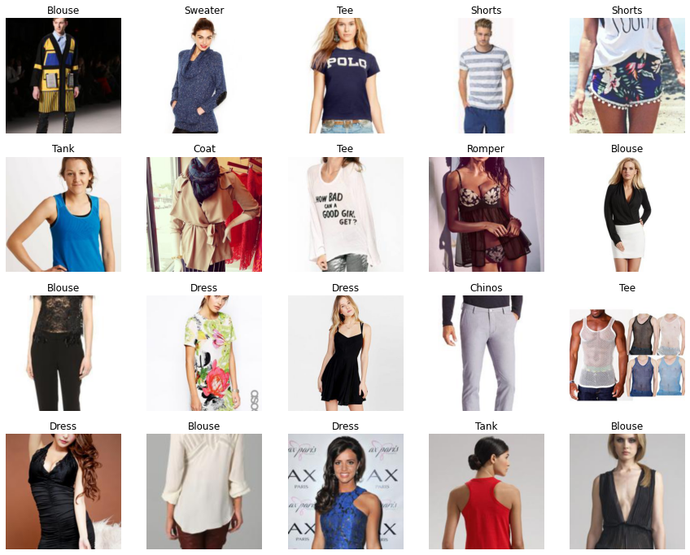

# clothing-articles-classification

This is a sample code for training a convolutional neural network (CNN) using Keras on the DeepFashion dataset. The goal of the model is to classify images of clothing into 46 different classes.

## Requirements

- Python 3.x
- Keras
- Tensorflow
- Numpy

## How to run

1. you can run the a copy of the notebook on colab with drive mounting as I did
2. or you can download it to run it locally
## DataSet 
As per required for the task to classify clothing articles the most two common options are MNISTFashion and DeepFashion datasets I chose this dataset as it is more close to the real world application unlike the MNIST dataset that I thought would be too trivial
### Data Handling 
* labelling the data was the first challenge as the most similar task published with the data is the attribute and category classification which is not what we need also none of the annotation files in the dataset directory has the required labels so I decided to generate the required labelling by getting it from processing the foldername for every subfolder in the dataset as I noticed that the clothing article can be found after the last `_` of the folder name; for example Reindeer_Pattern_Sweater is Sweater type and Lace_Swing_Tank is from Tank type. Finally store image path , label in a DataFrame then into csv file
* loading this large dataset in memory as single large container would be impossible so I used keras ImageDataGenerator to load the images from the desk to memory with smaller chunks at a time
* Additionally I used ImageDataGenerator to provide various sorts of data augmentation ( for example flipping , rotation and shearing ) but I noted that slowed down the training process so I removed it
* Also used FastAI's ImageDataLoader to visualize samples ( images , labels ) easily to get a sense of the dataset 

## Model architecture
### overview 
Deep CNN  classifier model with ~5 million parameters to keep things simple , fast and deployable in large scale with the following architecture 
### challenges 
* used GlobalAveragePooling and GlobalMaxPooling to handle the variable image size but this caused the model not to converge quickly 60% after 20 epochs 
* so, resized all images to 256*256 to have build robust model with Flatten Layer instead this converged much faster for the same CNN and pooling layers +80% after the 10th epoch and 60% after the 5th epoch which is a big enhancement compared to the previous approach
* added early stopping to avoid overfitting with patience 3 to stop training if the validation loss did not improve 
* with limited hardware resources for a faster training and limited time to complete the experiments ; transfer learning seemed to be a promising choice but I found some other experiments online that achieved similar results with model ResNet34, but nevertheless it worth more exploration.  

### Receptive Field 
- Receptive field for the first convolutional layer:

kernel size = (3, 3)
input image size = (256, 256)
Receptive field = (3, 3)
- Receptive field for the first MaxPooling2D layer:

pool size = (2, 2)
input image size = (128, 128) (after first convolutional layer)
Receptive field = (3, 3) + (2 - 1) = (4, 4)
- Receptive field for the second convolutional layer:

kernel size = (3, 3)
input image size = (64, 64) (after first MaxPooling2D layer)
Receptive field = (4, 4) + (3 - 1) = (6, 6)
- Receptive field for the second MaxPooling2D layer:

pool size = (2, 2)
input image size = (32, 32) (after second convolutional layer)
Receptive field = (6, 6) + (2 - 1) = (7, 7)
- Receptive field for the third convolutional layer:

kernel size = (3, 3)
input image size = (16, 16) (after second MaxPooling2D layer)
Receptive field = (7, 7) + (3 - 1) = (9, 9)
- Receptive field for the third MaxPooling2D layer:

pool size = (2, 2)
input image size = (8, 8)(after third convolutional layer)
- Receptive field = (9, 9) + (2 - 1) = (10, 10)

It's worth noting that the above calculations are based on the assumption that the stride is 1 and no padding is used, if the stride is greater than 1 or padding is used it will affect the receptive field size.

Also, it's worth noting that the receptive field size increases with each layer because each layer receives input from a larger region in the previous layer.

The overall receptive field of the model is the receptive field of the last convolutional layer which is 10x10 pixels, this means that the last convolutional layer receives input from a 10x10 pixels region in the original image.

* this can be increased by increasing the number of convolution and pooling layers

### FLOPS :
- FLOPs and MACs are the same here for every layer as we use only relu activations and no
- FLOPS for the first convolutional layer:

kernel size = (3, 3)
input channels = 3 (RGB image)
output channels = 32
input image size = (256, 256)
FLOPS = 2 * (3 * 3) * 3 * 32 * (256 * 256) = 2 * 9 * 3 * 32 * (256 * 256) = 21,477,248

- FLOPS for the second convolutional layer:

kernel size = (3, 3)
input channels = 32 (output channels from the first convolutional layer)
output channels = 64
input image size = (128, 128) (after max pooling with pool size = (2, 2))
FLOPS = 2 * (3 * 3) * 32 * 64 * (128 * 128) = 2 * 9 * 32 * 64 * (128 * 128) = 566,505,472
- FLOPS for the third convolutional layer:

kernel size = (3, 3)
input channels = 64 (output channels from the second convolutional layer)
output channels = 128
input image size = (64, 64) (after max pooling with pool size = (2, 2))
FLOPS = 2 * (3 * 3) * 64 * 128 * (64 * 64) = 2 * 9 * 64 * 128 * (64 * 64) = 14,619,264
- FLOPS for the dense layer:

Number of input neurons = (64 * 64 * 128)
Number of output neurons = num_classes
FLOPS = 2 * (64 * 64 * 128) * 46 = 48,234,496
 
* this can be decreased by increasing the number of pooling layers and/or resizing the input images to smaller images and/or decreasing the number of layers 
